# 🍕 Pizza Sales Dashboard – Power BI Project
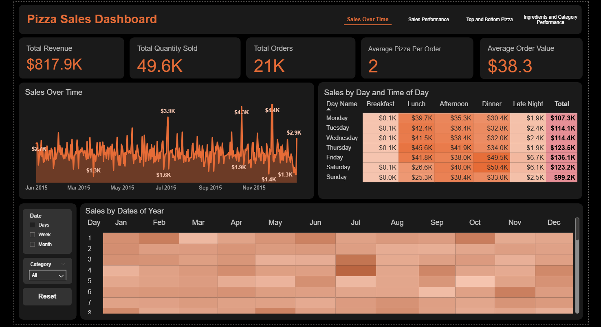

This project presents an interactive dashboard built with **Power BI** to explore and analyse pizza sales data. It uncovers key insights about customer behaviour, product performance, and time-based sales patterns to support business decisions.

---

## 📌 Summary
This repository contains a production-ready Power BI dashboard (**Pizza Sales Dashboard.pbix**, with PDF export) and documentation for analysing sales trends, peak ordering times, top/bottom pizzas and categories, size/ingredient patterns, and ordering behaviour. The report is designed for quick executive readouts and deeper ad-hoc analysis via slicers, bookmarks, and drill-through.

---

## 🎯 Project Objective

Visualise and analyse pizza sales performance by identifying peak ordering times, popular products/categories, and ingredient preferences, then turn these into simple actions for the business.

---

## 🧰 Tools & Technologies

- **Power BI Desktop**  
- **DAX (Data Analysis Expressions)**  
- **Power Query (M Language)**  
- **CSV / Excel files**

---

## 🗂️ Dataset Overview

The dataset includes:

- `order_id` – Unique identifier for each order  
- `date` – Date of the order  
- `time` – Time of the order  
- `pizza_id` – ID of the specific pizza ordered  
- `quantity` – Number of pizzas ordered  
- `size` – Size of the pizza (e.g., L, M, S)  
- `price` – Unit price of the pizza  
- `name` – Full pizza name  
- `category` – Pizza category (e.g., Chicken, Classic, Supreme)  
- `ingredients` – List of ingredients used in each pizza

---

## 📈  Dashboard Pages & Visuals
- **Sales Over Time**
  - KPIs (Revenue, Orders, Quantity, AOV, Pizzas per Order) + trend.  
  - Sales by Day & Time— Heatmap showing weekday vs hour; weekend/evening peaks.

  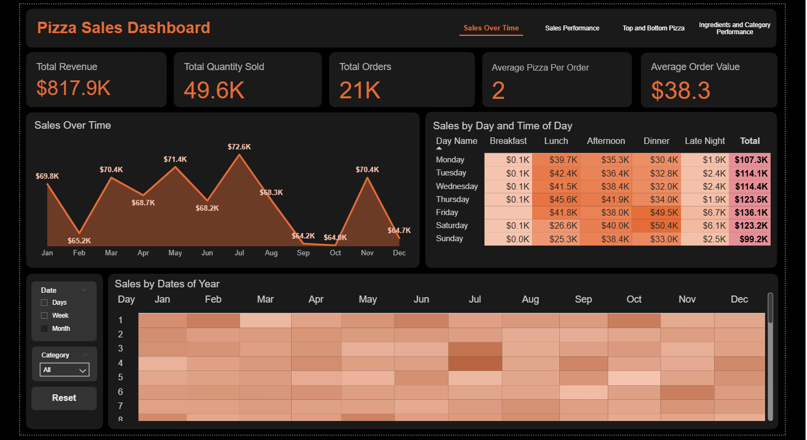
 
- **Top and Bottom Pizza**:
  - Bar charts show Top/Bottom Pizza in Revenue and Quantity.

  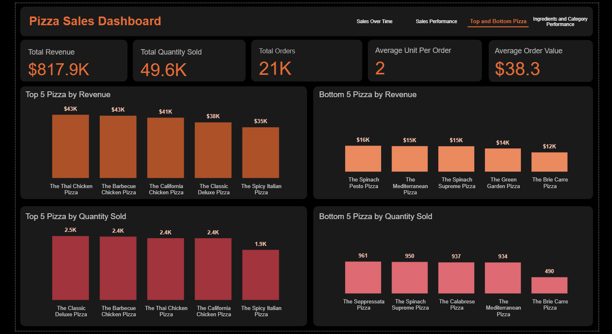

- **Sales Peformance**
  - Quantity Sold and Revenue by Category
  - Single and Mutli-items Orders Ratio
  - Avg time per Order
  - Category contribution and size mix (L/M/S/XL)

  
 
- **Ingredients and Category Performance**
  - Frequency of ingredients by category to support prep and purchasing  
  - Price vs Quantity - Scatter or correlation card to indicate price sensitivity

  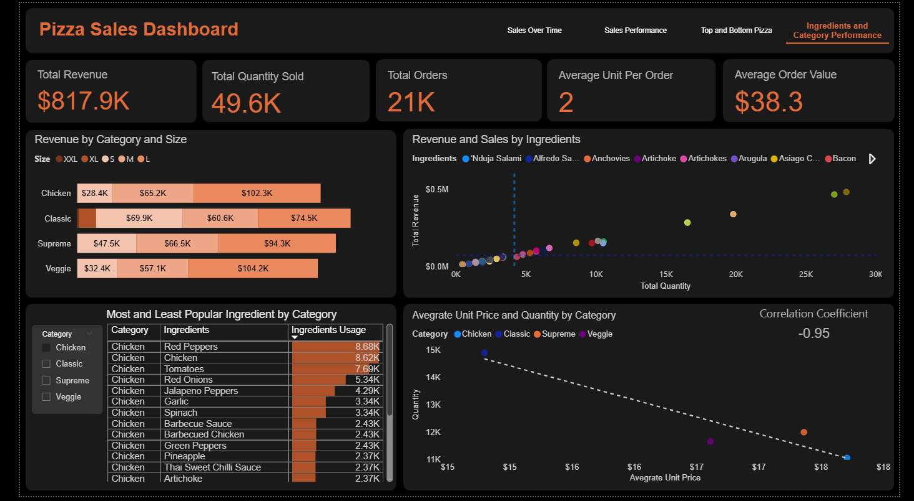

---

## 🧠 Key Insights
- **Scale:** ~$817.9K revenue from ~21K orders and ~49.6K items. AOV ~$38.3; ~2 pizzas/order.\

  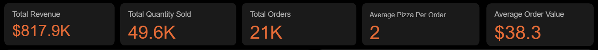

- **When people buy:** Demand peaks on **Fri–Sat evenings** and **afternoons (2–6 PM)**; **Mon & Sun** are lowest. End‑of‑month often dips.

  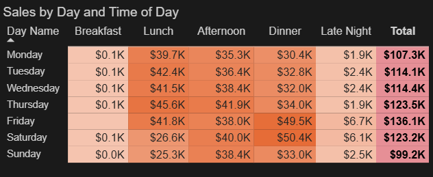

- **What sells:** **Classic** and **Supreme** categories lead. Top performers include Thai Chicken, Barbecue Chicken, California Chicken, Classic Deluxe, Spicy Italian. Low performers (e.g., Brie Carre, Mediterranean) need review.

  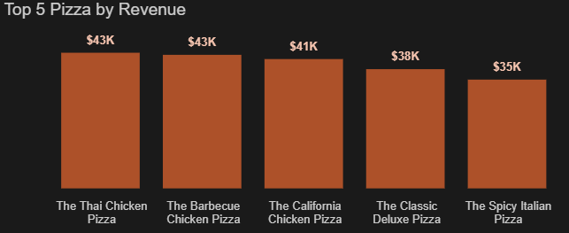

  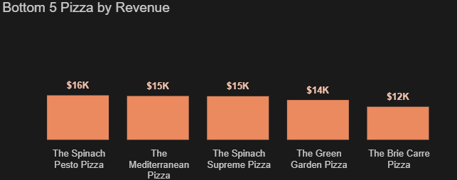
  
- **Sizes & behaviour:**
  - **Large Size** sells most.

  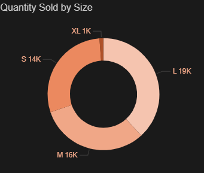

  - ~**61.6%** of orders include multiple items

  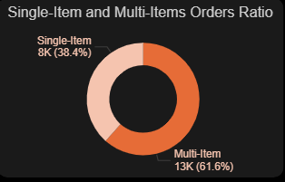

  - A average service time is around **10.9 minutes**.

  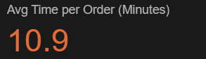
    
- **Pricing signal:** Strong **negative** relationship between price and quantity (≈ −0.95).

  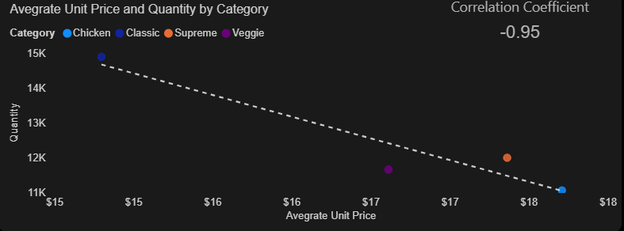

---

## 🛠️ Recommendations
- **Staffing & stock:** Cover **afternoons and weekend evenings**; schedule more kitchen and delivery crew then.
- **Promotions:** Use **flash deals** in the last days of the month; test promo spikes around the 4th/15th/27th.
- **Merchandising:** Feature **Classic & Supreme**; keep winning SKUs prominent; rework or retire bottom performers.
- **Sizing:** Push **Large‑size value bundles** for groups/families.
- **Pricing:** Where demand holds, favour **value‑adds** (premium toppings, size upgrades) over price hikes.
- **Ops:** Maintain a weekly **slow‑mover list** and adjust prep/purchasing; plan for seasonality.
